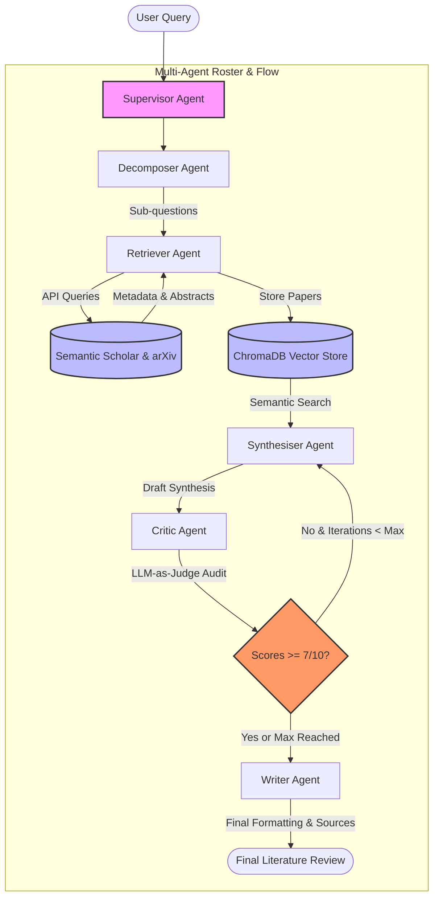

# ResearchPilot — Autonomous Academic Synthesis Engine

ResearchPilot is an advanced, multi-agent academic research assistant designed to transform a broad natural language query into a publication-ready, fully cited literature review in minutes. By orchestrating a coordinated team of specialized AI agents, ResearchPilot automates academic database searches, embeds papers into a semantic vector store, synthesises findings, and subjects drafts to a strict "LLM-as-judge" quality audit before producing the final manuscript.

---

## 1. The Problem

Writing academic literature reviews is a highly manual, time-consuming, and intellectually exhausting task. Researchers face several key obstacles:
1. **Information Overload**: Searching through databases like Semantic Scholar and ArXiv returns hundreds of papers, making it difficult to read and extract relevant insights quickly.
2. **Database Fragmentation**: Context is scattered across multiple publication databases, each requiring different query formats and extraction techniques.
3. **Manual Deduplication & Indexing**: Downloading PDFs, extracting abstracts, deduplicating records, and organizing findings is tedious.
4. **LLM Hallucinations**: Standard LLM-based writing assistants frequently invent citations, misrepresent sources, or synthesize literature without verifiable grounding.
5. **Critique & Iteration Gaps**: Without a systematic verification process, early drafts lack critical evaluation on coverage, factual grounding, and citation authenticity.

---

## 2. The Solution

ResearchPilot introduces an autonomous multi-agent pipeline that systematically addresses these bottlenecks:
- **Query Decomposition**: Breaks down broad topics into targeted, keyword-rich sub-questions to optimize search database retrieval.
- **Concurrent Hybrid Fetching**: Queries both ArXiv and Semantic Scholar APIs simultaneously, deduplicates papers based on title similarity, and caches results.
- **Semantic Vector Storage**: Embeds and indexes paper abstracts into a local vector database for fast semantic search.
- **LLM-as-Judge Quality Audit**: Employs a closed-loop review system. Each synthesis draft must pass a strict evaluation on *Coverage*, *Grounding*, and *Citation Accuracy* before compilation.
- **Dynamic Revision Loops**: If a draft fails the audit, the Critic Agent provides constructive, granular feedback, forcing the Synthesiser Agent to refine the block (up to a configurable maximum loop count).
- **Structured Publishing**: Standardizes bibliographies with absolute URLs, groups findings by sub-themes, and compiles a clean, publication-ready Markdown file.

---

## 3. System Architecture & Multi-Agent Roster

ResearchPilot divides the cognitive burden of research synthesis across six specialized agents, guided by a central supervisor.

### Architectural Flowchart



### The Agent Team

1. **Supervisor Agent**  
   * **Implementation**: [supervisor.py](file:///c:/Home/Events/5DayAiAgents/capstone/backend/agents/supervisor.py) (FastAPI Server-Sent Events router) & [supervisor_cli.py](file:///c:/Home/Events/5DayAiAgents/capstone/backend/agents/supervisor_cli.py) (CLI controller)
   * **Role**: Central orchestrator and state-machine manager.
   * **Responsibility**: Receives the query, initializes execution states, manages the critique-revision loop, compiles telemetry metrics, and streams events.

2. **Decomposer Agent**  
   * **Implementation**: [decomposer.py](file:///c:/Home/Events/5DayAiAgents/capstone/backend/agents/decomposer.py)  
   * **Role**: Query Segmenter.
   * **Responsibility**: Analyzes the user's broad query and breaks it down into 3-4 distinct academic sub-questions. This keyword-rich segmentation guarantees vastly superior database search results.

3. **Retriever Agent**  
   * **Implementation**: [retriever.py](file:///c:/Home/Events/5DayAiAgents/capstone/backend/agents/retriever.py)  
   * **Role**: Academic API Crawler.
   * **Responsibility**: Queries Semantic Scholar and ArXiv concurrently in background threads, deduplicates findings, and coordinates with the vector store to index paper metadata.

4. **Synthesiser Agent**  
   * **Implementation**: [synthesiser.py](file:///c:/Home/Events/5DayAiAgents/capstone/backend/agents/synthesiser.py)  
   * **Role**: Literature Surveyor.
   * **Responsibility**: Performs semantic vector searches on ChromaDB to retrieve the top 5 most relevant papers for each sub-question. Drafts a cohesive, dense synthesis paragraph with inline citations (`[Author et al., Year]`).

5. **Critic Agent**  
   * **Implementation**: [critic.py](file:///c:/Home/Events/5DayAiAgents/capstone/backend/agents/critic.py)  
   * **Role**: LLM-as-Judge Quality Auditor.
   * **Responsibility**: Audits each draft synthesis against the source papers on three metrics (0-10 scale): *Coverage*, *Grounding*, and *Citation Accuracy*. If any score falls below 7/10, it rejects the draft and issues detailed revision notes to the Synthesiser.

6. **Writer Agent**  
   * **Implementation**: [writer.py](file:///c:/Home/Events/5DayAiAgents/capstone/backend/agents/writer.py)  
   * **Role**: Manuscript Editor and Publisher.
   * **Responsibility**: Compiles individual syntheses, formats clickable bibliographical sources with URLs, identifies cross-cutting themes, and outputs the final cited Markdown document.

7. **Vector Store Manager**  
   * **Implementation**: [vector_store.py](file:///c:/Home/Events/5DayAiAgents/capstone/backend/agents/vector_store.py)  
   * **Role**: Embedding & Caching Engine.
   * **Responsibility**: Wraps local ChromaDB collections, handles asynchronous batch embeddings using `text-embedding-3-small`, deduplicates records, and retrieves context for syntheses.

---

## 4. Technical Stack

* **Language & Runtime**: Python 3.12 (managed via `uv`).
* **LLM & Embeddings Backbone**: OpenAI Client wrapper configured for the [AIML API](https://aimlapi.com/) endpoint:
  * **Chat Model**: `gpt-4o-mini` (Configurable via `.env`)
  * **Embedding Model**: `text-embedding-3-small` (1536 dimensions)
* **Vector Store**: ChromaDB (persisted locally under `backend/chroma_db/`).
* **Academic Integrations**: Semantic Scholar Academic Graph API + official ArXiv Python client.
* **Backend Web Framework**: FastAPI + Uvicorn with Event Stream (Server-Sent Events) generators.
* **Frontend Design**: Vanilla HTML5, CSS3 (Bento layout, Custom CSS variables, Glassmorphism, animations), Javascript client utilizing `marked.js` and `DOMPurify`.

---

## 5. Getting Started & Installation

### Prerequisites
* Python 3.11 or 3.12.
* [uv](https://github.com/astral-sh/uv) (Extremely fast Python package installer and manager).
* An AIML API key (Get one at [https://aimlapi.com/](https://aimlapi.com/)).

### Installation & Setup

1. **Clone or navigate to the project directory**:
   ```bash
   cd capstone
   ```

2. **Configure the Environment**:
   Copy `.env.example` to `.env` in the `backend/` folder:
   ```bash
   cp backend/.env.example backend/.env
   ```

3. **Populate `.env`**:
   Open `backend/.env` in your editor and add your AIML API Key:
   ```env
   AIMLABS_API_KEY=your_aiml_api_key_here
   ```

   > [!NOTE]
   > You can customize the chat model (`AIMLABS_CHAT_MODEL`), vector store path (`CHROMA_DB_PATH`), and academic search limits in this file.

---

## 6. Running the Project

### Option A: Command Line Interface (CLI)

To compile a literature review directly inside your terminal:
```bash
cd backend
uv run cli.py "What are the key approaches to handling multi-hop reasoning in RAG systems?"
```
* **Interactive CLI**: If you run `uv run cli.py` without a query argument, the tool will interactively prompt you for a research topic.
* **Output**: The compiled literature review will be saved to `literature_review.md` in the `backend/` directory, and detailed traces will be logged under `backend/logs/`.

### Option B: Interactive Web Interface (Recommended)

To run the interactive Bento dashboard:

1. **Start the FastAPI Backend**:
   Navigate to the backend directory, install dependencies, and start Uvicorn:
   ```bash
   cd backend
   uv pip install -r requirements.txt
   uv run uvicorn main:app --port 8000
   ```
   * *The backend API will run on [http://127.0.0.1:8000](http://127.0.0.1:8000).*

2. **Start the Static Frontend Server**:
   In a separate terminal tab in the workspace root, run the Python static file server:
   ```bash
   python -m http.server 5500 --directory frontend
   ```
   * *The frontend dashboard will run on [http://127.0.0.1:5500](http://127.0.0.1:5500).*

3. **Explore**:
   Open your browser and navigate to [http://127.0.0.1:5500/index.html](http://127.0.0.1:5500/index.html). Type your research inquiry and click **Begin Synthesis** to watch the agents execute and stream the manuscript in real-time.

### Option C: Notebook Integration

To run ResearchPilot directly inside Kaggle or Google Colab, see the copy-pasteable cells provided in the [Notebook Integration Guide](file:///c:/Home/Events/5DayAiAgents/capstone/docs/notebook_demo.md).

---

## 7. Project Directory Structure

```
capstone/
├── backend/                    # FastAPI Backend API & CLI Engine
│   ├── agents/                 # Specialized Agent Implementations
│   │   ├── decomposer.py       # Breaks queries down into sub-questions
│   │   ├── retriever.py        # Queries academic APIs and stores metadata
│   │   ├── synthesiser.py      # Drafts literature surveys with citations
│   │   ├── critic.py           # Audits synthesis blocks (LLM-as-judge)
│   │   ├── writer.py           # Publishes & formats final cited manuscript
│   │   ├── supervisor.py       # SSE Web supervisor agent
│   │   ├── supervisor_cli.py   # CLI supervisor agent
│   │   └── vector_store.py     # ChromaDB interface & embedding generator
│   ├── models/                 # Shared Pydantic data schemas
│   │   └── schemas.py          # Data models (Paper, CritiqueReport, SessionState)
│   ├── prompts/                # System instructions/prompt templates
│   │   ├── decomposer.txt
│   │   ├── synthesiser.txt
│   │   ├── critic.txt
│   │   └── writer.txt
│   ├── utils/                  # Utility libraries
│   │   ├── academic_search.py  # Semantic Scholar & ArXiv API wrappers
│   │   ├── llm.py              # OpenAI client wrappers & completions
│   │   └── observability.py    # Tracer & logger initialization
│   ├── cli.py                  # CLI runner entrypoint
│   ├── main.py                 # FastAPI backend server entrypoint
│   ├── config.py               # Settings and configuration loader
│   ├── requirements.txt        # Backend Python dependencies
│   ├── pyproject.toml          # uv project settings
│   └── uv.lock                 # Backend dependency lockfile
│
├── frontend/                   # Bento-Grid Web UI Dashboard
│   ├── index.html              # Bento UI structure
│   ├── style.css               # Glassmorphic animations and styles
│   ├── app.js                  # SSE Event dispatcher, UI update loops, & Markdown rendering
│   └── vercel.json             # Vercel deployment configurations
│
├── docs/                       # Auxiliary documentation
│   └── notebook_demo.md        # Kaggle & Colab integration instructions
│
└── README.md                   # Project documentation
```
